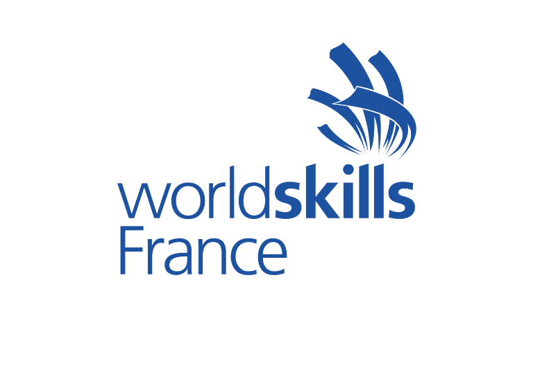
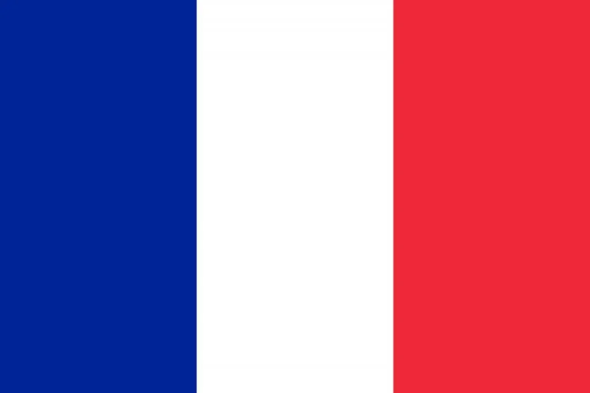
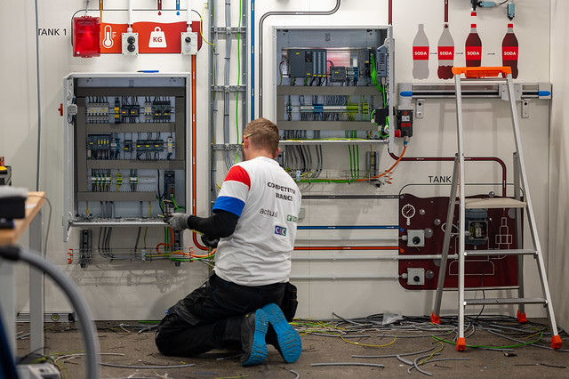
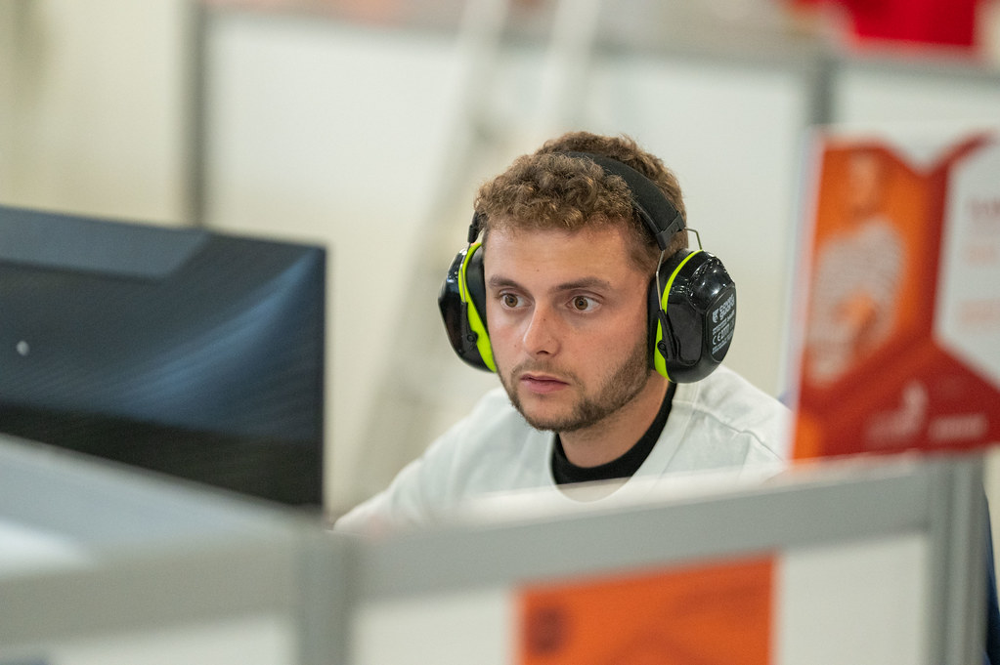
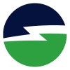
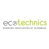

<!--

# Bienvenue sur mon Portfolio

Je suis Jordan Flament, Ingénieur en génie électrique et mécatronique en formation, passionné par l'optimisation des systèmes industriels en particulier l'automatisme.

À travers ce site, je vous invite à découvrir mon parcours professionnel ainsi que les différents projets techniques sur lesquels j'ai eu l'opportunité de travailler.

---

## Mon parcours

Après avoir réalisé 3 années à préparer mon bac chez les Compagnons du Devoir et du Tour de France, je me suis lancé sur le Tour de France qui m'a permis de travailler aux quatre coins de la France dans de nombreuses entreprises de secteurs différents. J'ai pu me découvrir une passion particulière pour l'industrie, en particulier l'électricité et l'automatisme.

<a href="https://compagnons-du-devoir.com/les-metiers/electrotechnique/" target="_blank" style="color: #4099ff; font-weight: bold; text-decoration: none;">Visitez le site des compagnons du devoir et du tour de France - Métier d'électrotechnicien ↗</a>

### Mon Parcours en Alternance

Voici l'évolution en parallèle de ma formation théorique et de mon expérience concrète en entreprise depuis la sortie du collège.

  

    <h3 style="margin-top: 0; color: #4099ff; display: flex; align-items: center; gap: 10px;">
      🎓 Formation (École)
    </h3>
    
Mon apprentissage théorique et mes diplômes.

    
    <ul style="list-style: none; padding-left: 0; margin-bottom: 0;">
      <li style="margin-bottom: 25px; border-bottom: 1px dashed rgba(128,128,128,0.2); padding-bottom: 15px;">
        09/&#8203;2025 - En cours
        Diplôme d'ingénieur en génie électrique et mécatronique
        
          Polytech'Lille
         
        59655 - Villeneuve d'Ascq
      </li>
      <li style="margin-bottom: 25px; border-bottom: 1px dashed rgba(128,128,128,0.2); padding-bottom: 15px;">
        09/&#8203;2024 - 08/2025
        Licence pro Systèmes Automatisés, Réseaux et Informatique Industriel
        
          Proméo Formation
         
        Mention : Bien 
        80080 - Amiens
      </li>
      <li style="margin-bottom: 25px; border-bottom: 1px dashed rgba(128,128,128,0.2); padding-bottom: 15px;">
        09/&#8203;2022 - 08/2024
        BTS électrotechnique
        
          Les compagnons du devoir et du tour de France
         
        37100 - Tours
      </li>
      <li style="margin-bottom: 25px; border-bottom: 1px dashed rgba(128,128,128,0.2); padding-bottom: 15px;">
        09/&#8203;2022 - 08/2023
        Titre pro Technicien Supérieur en Maintenance Industrielle
        
          Les compagnons du devoir et du tour de France
         
        37100 - Tours
      </li>
      <li style="margin-bottom: 25px; border-bottom: 1px dashed rgba(128,128,128,0.2); padding-bottom: 15px;">
        09/&#8203;2021 - 08/2022
        Titre pro Technicien en Maintenance Industrielle
        
          Les compagnons du devoir et du tour de France
         
        59491 - Villeneuve d'Ascq
      </li>
      <li style="margin-bottom: 25px; border-bottom: 1px dashed rgba(128,128,128,0.2); padding-bottom: 15px;">
        09/&#8203;2018 - 08/2021
        Bac Pro Métier de l'Electricité et de ses Environnements Connectés
        
          Les compagnons du devoir et du tour de France
         
        Mention : Très bien 
        59491 - Villeneuve d'Ascq
      </li>
      <li style="margin-bottom: 25px; border-bottom: 1px dashed rgba(128,128,128,0.2); padding-bottom: 15px;">
        09/&#8203;2018 - 08/2020
        BEP Electrotechnique
        
          Les compagnons du devoir et du tour de France
         
        59491 - Villeneuve d'Ascq
      </li>
    </ul>
  

  

    <h3 style="margin-top: 0; color: #00c853; display: flex; align-items: center; gap: 10px;">
      🏢 Expérience (Entreprise)
    </h3>
    
Mes missions et compétences industrielles.

    
    <ul style="list-style: none; padding-left: 0; margin-bottom: 0;">
      <li style="margin-bottom: 25px; border-bottom: 1px dashed rgba(128,128,128,0.2); padding-bottom: 15px;">
        09/&#8203;2024 - En cours
        Apprenti Ingénieur Automaticien
        
          Pouchain SAS
         
        59553 - Cuincy
        <small style="display: block; margin-top: 5px; opacity: 0.8;">• Programmation d'automates  • Réalisation de supervisions  • TIA Portal, Step 7, PCS7 • EcoStructure, Unity pro, PL7-pro   • PcVue   • PnozMultiConfigurator  • Windowserie  • Réseaux  • Réalisation de schémas électrique (See-Electrical Expert) </small>
      </li>
      <li style="margin-bottom: 25px; border-bottom: 1px dashed rgba(128,128,128,0.2); padding-bottom: 15px;">
        09/&#8203;2023 - 08/&#8203;2024
        Apprenti Electrotechnicien
        
          SGM Industry
         
        33830 - Belin-Béliet
        <small style="display: block; margin-top: 5px; opacity: 0.8;">• Réalisation de machines pour des parcs à bois, scieries   • Etude électrique (e-plan - see electrical expert)   • Automatisme (TIA Portal)   • Réalisation des armoires électriques  • Réalisation du câblage machine   • Essais et validation   • Dépannage - SAV   • Devis et commande </small>      
      </li>
      <li style="margin-bottom: 25px; border-bottom: 1px dashed rgba(128,128,128,0.2); padding-bottom: 15px;">
        09/&#8203;2022 - 08/&#8203;2023
        Apprenti Technicien de maintenance itinérant
        
          MécaService
         
        56350 - Rieux
        <small style="display: block; margin-top: 5px; opacity: 0.8;">• Maintenance mécanique   • Maintenance électrique   • Maintenance pneumatique   • Maintenance hydraulique   • Transfert industriel   • Dépannage   • Devis et étude électrique </small>
      </li>
      <li style="margin-bottom: 25px; border-bottom: 1px dashed rgba(128,128,128,0.2); padding-bottom: 15px;">
        09/&#8203;2021 - 08/&#8203;2022
        Apprenti monteur-câbleur
        
          Eurodifroid
         
        49140 - Seiches-sur-le-Loir
        <small style="display: block; margin-top: 5px; opacity: 0.8;">• Réalisation de machines de refroidissement   • Réalisation de coffret et armoires électriques   • Câblage machine   • Auto-contrôle</small>
      </li> 
      <li style="margin-bottom: 25px; border-bottom: 1px dashed rgba(128,128,128,0.2); padding-bottom: 15px;">
        09/&#8203;2018 - 08/&#8203;2021
        Apprenti électricien
        
          Ecotechnics
         
        59650 - Villeneuve d'Ascq
        <small style="display: block; margin-top: 5px; opacity: 0.8;">• Réalisation d'installation électrique domestique et tertiaire  • Courant fort (CFO)   • Courant faible (CFA)   • Contrôle d'accès   • Incendie   • Réseau Ethernet   • Intrusion   • Vidéo-surveillance   • Gestion de chantier </small>
      </li>        
    </ul>
  

  <h3>📍 Découvrez les lieux où j'ai travaillé et étudié !</h3>
  <iframe src="https://www.google.com/maps/d/u/0/embed?mid=19ZCTunMfb4iA7ofJiCRShvcs7SDFyaI&ehbc=2E312F" width="100%" height="450" style="border:0; border-radius: 8px; box-shadow: 0 4px 6px rgba(0,0,0,0.1);" allowfullscreen="" loading="lazy"></iframe>

---

## 🚀 Mes Projets

Voici quelques-uns des projets sur lesquels j'ai travaillé. Cliquez sur une carte pour voir les détails et les photos !

  <a href="projetYacco/" style="flex: 1; min-width: 200px; max-width: 250px; text-decoration: none;">
    

      
🤖

      <h3 style="margin: 0; color: #4099ff; font-size: 1.2em;">Convoyage d'une ligne d'embouteillage</h3>
      
Etude et développement du programme et de la supervision

    

  </a>

  <a href="projetKingspan/" style="flex: 1; min-width: 200px; max-width: 250px; text-decoration: none;">
    

      
⚡

      <h3 style="margin: 0; color: #00c853; font-size: 1.2em;">Retrofit Safety d'un stacker</h3>
      
Etude électrique et intégration d'un automate safety

    

  </a>

---

## Worldskills

En 2022, j'ai fait le choix de repousser mes limites en participant aux **WorldSkills** (anciennement Olympiades des Métiers), la plus grande compétition de métiers au monde.

Engagé dans la catégorie *Électrotechnique et Automatisme Industriel*, cette aventure m'a demandé un investissement total et m'a permis de franchir plusieurs étapes décisives :

* **🥇 Médaille d'Or - Région Hauts-de-France :** Cette première victoire m'a permis de me qualifier directement pour les épreuves nationales.
* **🥉 Médaille de Bronze - Finales Nationales :** Une place sur le podium qui m'a ouvert les portes des sélections très exigeantes de l'Équipe de France.
* ** Sélection en Équipe de France :** À l'issue d'une épreuve de départage intense entre les trois médaillés nationaux, j'ai décroché ma qualification pour représenter le pays à l'international.
* **🌍 12ème place Mondiale - Lyon 2024 :** L'aboutissement de ce parcours d'excellence, en affrontant les meilleurs talents de la planète lors de la compétition mondiale.

 
<a href="https://www.worldskills-france.org/" target="_blank" style="color: #4099ff; font-weight: bold; text-decoration: none;">Visitez le site de Worldskills France ↗</a> 
<a href="https://www.worldskills-france.org/metiers/electrotechnique-et-automatisme-industriel/" target="_blank" style="color: #4099ff; font-weight: bold; text-decoration: none;">Visitez le site de Worldskills France du métier électrotechnique et automatisme industriel ↗</a>

### Ma réalisation (Mondial Lyon 2024)

L'épreuve consiste à réaliser sur 4 jours :

* Une installation électrique complète en 12h
* La programmation sous TIA portal de tous les composants en 6h
* La création d'un schéma électrique sous FluidSim en 1h
* Trouver 5 pannes en 1h

Voici un aperçu de mon travail lors de cette épreuve internationale :

  
  

  <a href="https://www.flickr.com/photos/worldskillsfrance/albums/72177720320070698" target="_blank" style="background-color: #4099ff; color: white; padding: 10px 20px; text-decoration: none; border-radius: 5px; font-weight: bold; box-shadow: 0 4px 6px rgba(0,0,0,0.1);">Voir l'album complet sur Flickr ↗</a>

### Mon engagement en tant qu'Expert Référent Territorial (ERT)

Suite à mon parcours en tant que compétiteur, me voici de l'autre côté de la barrière à jouer un rôle majeur dans le développement du métier de **l'électrotechnique et automatisme industriel** en endossant le rôle d'**expert référent territorial** qui consiste à : 

* Création de sujets de compétitions régionales en tronc commun pour toutes les régions.
* Effectuer le suivi des épreuves régionales.
* Accompagner chaque région sur l’utilisation du sujet, des règles ainsi que du CIS (ce qui permet la notation des candidats).
* Contribution de manière générale au développement du métier de l'échelle régionale à l'échelle nationale.
* Gérer l'organisation des compétitons régionales avec l'aide des régions, aussi bien organisationnel que matériel.

### Mon engagement en tant que bénévole dans l'équipe métier en électrotechnique et automatisme industriel.

En plus de ma mission d'**expert référent téritorial**, je participe au développement du métier ainsi qu'à l'organisation des compétitons et des entraînements comme :

* Accompagner le candidat représentant la France durant sa préparation sur les aspects techniques de la compétition comme la programmation ou la création de schémas électrique.
* Développer des sujets de compétiton au niveau régionale et nationale.
* Développer des supports de formation pour permettre aux candidats de booster leur progression et d'acquérir un maximum de compétences.
-->

<!-- BOUTON CV FLOTTANT 
<a href="/images/CV.pdf" target="_blank" style="position: fixed; bottom: 30px; left: 30px; z-index: 9999; background-color: #4099ff; color: white; padding: 12px 24px; text-decoration: none; border-radius: 30px; font-weight: bold; font-size: 0.9em; box-shadow: 0 4px 15px rgba(0,0,0,0.3);">
  📄 Télécharger mon CV
</a>
-->

  
  

    <h1 style="margin-top: 0; margin-bottom: 15px; font-size: 2.2em; color: #ffffff;">Bienvenue sur mon Portfolio</h1>
    
Je suis <strong>Jordan Flament</strong>, Ingénieur en génie électrique et mécatronique en formation, passionné par l'optimisation des systèmes industriels et tout particulièrement l'automatisme.

    
À travers ce site, je vous invite à découvrir mon parcours professionnel ainsi que les différents projets techniques sur lesquels j'ai eu l'opportunité de travailler.

  

---

## 🛠️ Mes Compétences Techniques

Un aperçu des logiciels, matériels et technologies que j'utilise et configure au quotidien dans le monde industriel :

  

    <h3 style="margin-top: 0; color: #ffffff; font-size: 1.2em; border-bottom: 1px solid rgba(255,255,255,0.1); padding-bottom: 10px;">🤖 Automatisme</h3>
    

      TIA Portal
      PCS7
      Step 7
      EcoStruxure
      Unity Pro
      PL7-pro
    

  

  

    <h3 style="margin-top: 0; color: #ffffff; font-size: 1.2em; border-bottom: 1px solid rgba(255,255,255,0.1); padding-bottom: 10px;">⚡ Étude Électrique</h3>
    

      See-Electrical Expert
      E-plan
      FluidSim
      Lecture & Création de schémas
    

  

  

    <h3 style="margin-top: 0; color: #ffffff; font-size: 1.2em; border-bottom: 1px solid rgba(255,255,255,0.1); padding-bottom: 10px;">🖥️ Supervision & Sécurité</h3>
    

      PcVue
      WinCc
      PnozMultiConfigurator
      Windowserie
      Réseaux Industriels
    

  

  

    <h3 style="margin-top: 0; color: #ffffff; font-size: 1.2em; border-bottom: 1px solid rgba(255,255,255,0.1); padding-bottom: 10px;">🔧 Terrain & Maintenance</h3>
    

      Câblage d'armoires
      Mécanique
      Pneumatique
      Hydraulique
      Recherche de pannes
    

  

  

    <h3 style="margin-top: 0; color: #ffffff; font-size: 1.2em; border-bottom: 1px solid rgba(255,255,255,0.1); padding-bottom: 10px;">💻 Informatique & Robotique</h3>
    

      C++ / C / Python
      PHP / JavaScript
      HTML / CSS / LaTeX
      Windows / Linux
      Robotique : Fanuc / Stäubli
    

  

---

## 🧭 Mon parcours

  
  

    
Après avoir passé 3 années à préparer mon bac chez les <strong>Compagnons du Devoir et du Tour de France</strong>, je me suis lancé sur le Tour de France. Cette aventure m'a permis de travailler aux quatre coins du pays dans de nombreuses entreprises de secteurs différents. J'y ai découvert une passion particulière pour l'industrie, l'électricité et l'automatisme.

    <a href="https://compagnons-du-devoir.com/les-metiers/electrotechnique/" target="_blank" style="display: inline-block; background-color: #ff9900; color: white; padding: 8px 15px; border-radius: 5px; text-decoration: none; font-weight: bold; font-size: 0.9em; box-shadow: 0 2px 4px rgba(0,0,0,0.2);">🔗 Visiter le site - Métier d'électrotechnicien</a>
  

### Mon Parcours en Alternance

Voici l'évolution en parallèle de ma formation théorique et de mon expérience concrète en entreprise depuis la sortie du collège.

  <!-- COLONNE ÉCOLE -->
  

    <h3 style="margin-top: 0; color: #4099ff; display: flex; align-items: center; gap: 10px;">🎓 Formation (École)</h3>
    
Mon apprentissage théorique et mes diplômes.

    
    <ul style="list-style: none; padding-left: 0; margin-bottom: 0; color: #e9ecef;">
      <li style="margin-bottom: 25px; border-bottom: 1px dashed rgba(255,255,255,0.1); padding-bottom: 15px;">
        09/2025 &#8203 - En cours
        Diplôme d'ingénieur en génie électrique et mécatronique
        
          Polytech'Lille
         
        59655 - Villeneuve d'Ascq
      </li>
      <li style="margin-bottom: 25px; border-bottom: 1px dashed rgba(255,255,255,0.1); padding-bottom: 15px;">
        09/&2024 &#8203 - 08/2025
        Licence pro Systèmes Automatisés, Réseaux et Informatique Industriel
        
          Proméo Formation
         
        Mention : Bien 
        80080 - Amiens
      </li>
      <li style="margin-bottom: 25px; border-bottom: 1px dashed rgba(255,255,255,0.1); padding-bottom: 15px;">
        09/2022 &#8203 - 08/2024
        BTS électrotechnique
        
          Les compagnons du devoir et du tour de France
         
        37100 - Tours
      </li>
      <li style="margin-bottom: 25px; border-bottom: 1px dashed rgba(255,255,255,0.1); padding-bottom: 15px;">
        09/2022 &#8203 - 08/2023
        Titre pro Technicien Supérieur en Maintenance Industrielle
        
          Les compagnons du devoir et du tour de France
         
        37100 - Tours
      </li>
      <li style="margin-bottom: 25px; border-bottom: 1px dashed rgba(255,255,255,0.1); padding-bottom: 15px;">
        09/2021 &#8203 - 08/2022
        Titre pro Technicien en Maintenance Industrielle
        
          Les compagnons du devoir et du tour de France
         
        59491 - Villeneuve d'Ascq
      </li>
      <li style="margin-bottom: 25px; border-bottom: 1px dashed rgba(255,255,255,0.1); padding-bottom: 15px;">
        09/2018 &#8203 - 08/2021
        Bac Pro Métier de l'Electricité et de ses Environnements Connectés
        
          Les compagnons du devoir et du tour de France
         
        Mention : Très bien 
        59491 - Villeneuve d'Ascq
      </li>
      <li style="margin-bottom: 25px; border-bottom: 1px dashed rgba(255,255,255,0.1); padding-bottom: 15px;">
        09/2018 &#8203 - 08/2020
        BEP Electrotechnique
        
          Les compagnons du devoir et du tour de France
         
        59491 - Villeneuve d'Ascq
      </li>
    </ul>
  

  <!-- COLONNE ENTREPRISE -->
  

    <h3 style="margin-top: 0; color: #00c853; display: flex; align-items: center; gap: 10px;">🏢 Expérience (Entreprise)</h3>
    
Mes missions et compétences industrielles.

    
    <ul style="list-style: none; padding-left: 0; margin-bottom: 0; color: #e9ecef;">
      <li style="margin-bottom: 25px; border-bottom: 1px dashed rgba(255,255,255,0.1); padding-bottom: 15px;">
        09/2024 &#8203 - En cours
        Apprenti Ingénieur Automaticien
        
          Pouchain SAS
         
        59553 - Cuincy
        <small style="display: block; margin-top: 5px; color: #adb5bd; line-height: 1.5;">• Programmation d'automates  • Réalisation de supervisions  • TIA Portal, Step 7, PCS7 • EcoStructure, Unity pro, PL7-pro   • PcVue   • PnozMultiConfigurator  • Windowserie  • Réseaux  • Réalisation de schémas électrique (See-Electrical Expert) </small>
      </li>
      <li style="margin-bottom: 25px; border-bottom: 1px dashed rgba(255,255,255,0.1); padding-bottom: 15px;">
        09/2023 &#8203 - 08/2024
        Apprenti Electrotechnicien
        
          SGM Industry
         
        33830 - Belin-Béliet
        <small style="display: block; margin-top: 5px; color: #adb5bd; line-height: 1.5;">• Réalisation de machines pour des parcs à bois, scieries   • Etude électrique (e-plan - see electrical expert)   • Automatisme (TIA Portal)   • Réalisation des armoires électriques  • Réalisation du câblage machine   • Essais et validation   • Dépannage - SAV   • Devis et commande </small>      
      </li>
      <li style="margin-bottom: 25px; border-bottom: 1px dashed rgba(255,255,255,0.1); padding-bottom: 15px;">
        09/2022 &#8203 - 08/2023
        Apprenti Technicien de maintenance itinérant
        
          MécaService
         
        56350 - Rieux
        <small style="display: block; margin-top: 5px; color: #adb5bd; line-height: 1.5;">• Maintenance mécanique   • Maintenance électrique   • Maintenance pneumatique   • Maintenance hydraulique   • Transfert industriel   • Dépannage   • Devis et étude électrique </small>
      </li>
      <li style="margin-bottom: 25px; border-bottom: 1px dashed rgba(255,255,255,0.1); padding-bottom: 15px;">
        09/2021 &#8203 - 08/2022
        Apprenti monteur-câbleur
        
          Eurodifroid
         
        49140 - Seiches-sur-le-Loir
        <small style="display: block; margin-top: 5px; color: #adb5bd; line-height: 1.5;">• Réalisation de machines de refroidissement   • Réalisation de coffret et armoires électriques   • Câblage machine   • Auto-contrôle</small>
      </li> 
      <li style="margin-bottom: 25px; border-bottom: 1px dashed rgba(255,255,255,0.1); padding-bottom: 15px;">
        09/2018 &#8203 - 08/2021
        Apprenti électricien
        
          Ecotechnics
         
        59650 - Villeneuve d'Ascq
        <small style="display: block; margin-top: 5px; color: #adb5bd; line-height: 1.5;">• Réalisation d'installation électrique domestique et tertiaire  • Courant fort (CFO)   • Courant faible (CFA)   • Contrôle d'accès   • Incendie   • Réseau Ethernet   • Intrusion   • Vidéo-surveillance   • Gestion de chantier </small>
      </li>        
    </ul>
  

  <h3 style="color: #ffffff; margin-bottom: 20px;">📍 Découvrez les lieux où j'ai travaillé et étudié !</h3>
  <iframe src="https://www.google.com/maps/d/u/0/embed?mid=19ZCTunMfb4iA7ofJiCRShvcs7SDFyaI&ehbc=2E312F" width="100%" height="450" style="border:0; border-radius: 8px; box-shadow: 0 4px 15px rgba(0,0,0,0.3);" allowfullscreen="" loading="lazy"></iframe>

---

## 🚀 Mes Projets

Voici quelques-uns des projets sur lesquels j'ai travaillé. Cliquez sur une carte pour voir les détails et les photos !

  <a href="projetYacco/" style="flex: 1; min-width: 200px; max-width: 250px; text-decoration: none;">
    

      
🤖

      <h3 style="margin: 0; color: #4099ff; font-size: 1.2em;">Convoyage d'une ligne d'embouteillage</h3>
      
Etude et développement du programme et de la supervision

    

  </a>

  <a href="projetKingspan/" style="flex: 1; min-width: 200px; max-width: 250px; text-decoration: none;">
    

      
⚡

      <h3 style="margin: 0; color: #00c853; font-size: 1.2em;">Retrofit Safety d'un stacker</h3>
      
Etude électrique et intégration d'un automate safety

    

  </a>

---

## 🌍 L'Aventure WorldSkills

  

    
  

  
  
En 2022, j'ai fait le choix de repousser mes limites en participant aux <strong>WorldSkills</strong> (anciennement Olympiades des Métiers), la plus grande compétition de métiers au monde. Engagé dans la catégorie <em>Électrotechnique et Automatisme Industriel</em>, cette aventure m'a demandé un investissement total et m'a permis de franchir plusieurs étapes décisives :

  
  

    

      
🥇

      <strong>Médaille d'Or</strong> 
      Hauts-de-France
    

    

      
🥉

      <strong>Médaille de Bronze</strong> 
      Finales Nationales
    

    

      

      <strong>Équipe de France</strong> 
      Qualification
    

    

      
🌍

      <strong>12ème Mondiale</strong> 
      Lyon 2024
    

  

  

    <a href="https://www.worldskills-france.org/" target="_blank" style="display: inline-block; background-color: rgba(64,153,255,0.15); color: #4099ff; padding: 8px 15px; border-radius: 5px; text-decoration: none; font-weight: bold; font-size: 0.9em; margin: 5px; border: 1px solid rgba(64,153,255,0.3);">🌐 WorldSkills France</a>
    <a href="https://www.worldskills-france.org/metiers/electrotechnique-et-automatisme-industriel/" target="_blank" style="display: inline-block; background-color: rgba(64,153,255,0.15); color: #4099ff; padding: 8px 15px; border-radius: 5px; text-decoration: none; font-weight: bold; font-size: 0.9em; margin: 5px; border: 1px solid rgba(64,153,255,0.3);">⚙️ Fiche métier - Electrotechnique et Automatisme Industriel</a>
  

### Ma réalisation (Mondial Lyon 2024)

L'épreuve est un véritable marathon technique qui consiste à réaliser sur 4 jours :

  

    ⚡
    <strong>12h</strong> Installation électrique
  

  

    💻
    <strong>6h</strong> Programmation TIA Portal
  

  

    📐
    <strong>1h</strong> Schéma FluidSim
  

  

    🔍
    <strong>1h</strong> Recherche de 5 pannes
  

Voici un aperçu de mon travail lors de cette épreuve internationale :

  
  

  <a href="https://www.flickr.com/photos/worldskillsfrance/albums/72177720320070698" target="_blank" style="display: inline-block; background-color: #4099ff; color: white; padding: 12px 25px; text-decoration: none; border-radius: 5px; font-weight: bold; box-shadow: 0 4px 6px rgba(0,0,0,0.2);">📸 Voir l'album complet sur Flickr</a>

### Mon engagement post-compétition

  <!-- CARTE ERT -->
  

    <h4 style="margin-top: 0; color: #9b59b6; font-size: 1.1em;">📋 Expert Référent Territorial (ERT)</h4>
    
Je joue aujourd'hui un rôle majeur dans le développement du métier en région à l'échelle nationale :

    <ul style="padding-left: 20px; font-size: 0.9em; margin-bottom: 0; line-height: 1.5; color: #ced4da;">
      <li>Création de sujets de compétitions régionales en tronc commun.</li>
      <li>Suivi rigoureux des épreuves en région.</li>
      <li>Accompagnement sur l’utilisation du sujet, des règles et du système de notation (CIS).</li>
      <li>Organisation logistique et matérielle des compétitions.</li>
      <li>Développement général du métier de l'échelle régionale à nationale.</li>
    </ul>
  

  <!-- CARTE BÉNÉVOLE -->
  

    <h4 style="margin-top: 0; color: #e67e22; font-size: 1.1em;">🤝 Bénévole Équipe Métier</h4>
    
Je participe activement à l'entraînement et à la transmission de mon savoir :

    <ul style="padding-left: 20px; font-size: 0.9em; margin-bottom: 0; line-height: 1.5; color: #ced4da;">
      <li>Accompagnement technique du candidat représentant la France (programmation, schémas).</li>
      <li>Développement de nouveaux sujets d'entraînement et de compétition.</li>
      <li>Création de supports de formation pour booster la progression des futurs candidats.</li>
    </ul>
  

---

## 📬 Me contacter

  Mon profil vous intéresse ? Vous avez une question sur l'un de mes projets ou vous souhaitez échanger sur des opportunités dans l'automatisme et la mécatronique ? N'hésitez pas à me contacter directement sur la plateforme de votre choix !

  
  <!-- EMAIL -->
  <a href="mailto:flamentjordan060803@gmail.com" style="flex: 1; min-width: 250px; background: rgba(64, 153, 255, 0.05); border: 1px solid rgba(64, 153, 255, 0.2); padding: 25px 20px; border-radius: 10px; text-align: center; text-decoration: none; color: #ffffff; box-shadow: 0 4px 6px rgba(0,0,0,0.2);">
    
📧

    <h3 style="margin: 0; color: #4099ff; font-size: 1.2em;">Par Email</h3>
    
M'envoyer un message

  </a>

  <!-- LINKEDIN -->
  <a href="https://www.linkedin.com/in/jordan-flament-6247b41b6" target="_blank" style="flex: 1; min-width: 250px; background: rgba(10, 102, 194, 0.05); border: 1px solid rgba(10, 102, 194, 0.3); padding: 25px 20px; border-radius: 10px; text-align: center; text-decoration: none; color: #ffffff; box-shadow: 0 4px 6px rgba(0,0,0,0.2);">
    
💼

    <h3 style="margin: 0; color: #5dade2; font-size: 1.2em;">LinkedIn</h3>
    
Découvrir mon réseau professionnel

  </a>

<!-- BOUTON CV FLOTTANT -->
<a href="/images/CV.pdf" target="_blank" style="position: fixed; bottom: 30px; left: 30px; z-index: 9999; background-color: #4099ff; color: white; padding: 12px 24px; text-decoration: none; border-radius: 30px; font-weight: bold; font-size: 0.9em; box-shadow: 0 4px 15px rgba(0,0,0,0.5);">
  📄 Télécharger mon CV
</a>

