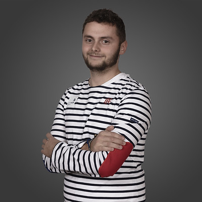
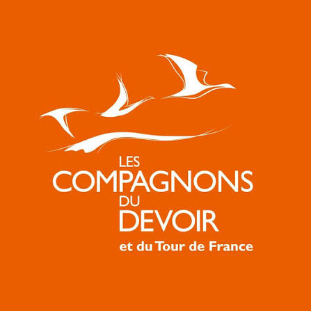
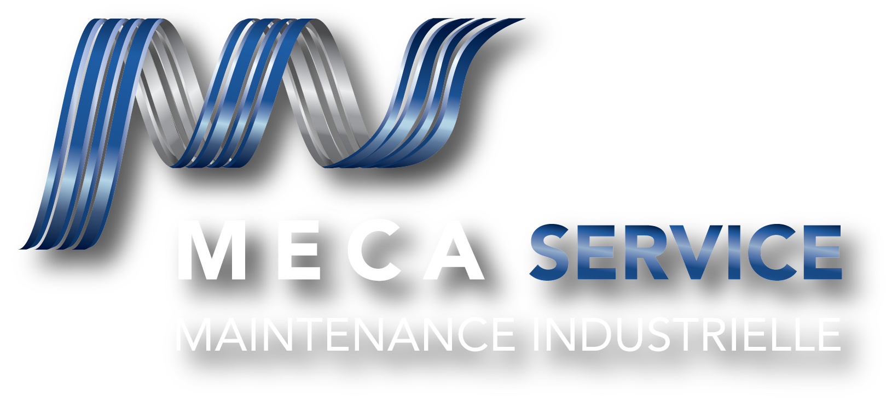
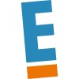

# Bienvenue sur mon Portfolio

Je suis Jordan Flament, Ingénieur en génie électrique et mécatronique en formation, passionné par l'optimisation des systèmes industriels en particulier l'automatisme.

À travers ce site, je vous invite à découvrir mon parcours professionnel ainsi que les différents projets techniques sur lesquels j'ai eu l'opportunité de travailler.

---

# Mon parcours

## Les Compagnons du Devoir et du Tour de France

Après avoir réalisé 3 années à préparer mon bac chez les Compagnons du Devoir et du Tour de France, je me suis lancé sur le Tour de France qui m'a permis de travailler aux quatre coins de la France dans de nombreuses entreprises de secteurs différents. J'ai pu me découvrir une passion particulière pour l'industrie, en particulier l'électricité et l'automatisme.

## Mon Parcours en Alternance

Voici l'évolution en parallèle de ma formation théorique et de mon expérience concrète en entreprise depuis la sortie du collège.

  <!-- COLONNE ÉCOLE -->
  

    <h3 style="margin-top: 0; color: #4099ff; display: flex; align-items: center; gap: 10px;">
      🎓 Formation (École)
    </h3>
    
Mon apprentissage théorique et mes diplômes.

    
    <ul style="list-style: none; padding-left: 0; margin-bottom: 0;">
      <li style="margin-bottom: 25px; border-bottom: 1px dashed rgba(128,128,128,0.2); padding-bottom: 15px;">
        09/2025 - En cours
        Diplôme d'ingénieur en génie électrique et mécatronique
        
          Polytech'Lille
         
        59655 - Villeneuve d'Ascq
      </li>
      <li style="margin-bottom: 25px; border-bottom: 1px dashed rgba(128,128,128,0.2); padding-bottom: 15px;">
        09/2024 - 08/2025
        Licence pro Systèmes Automatisés, Réseaux et Informatique Industriel
        
          Proméo Formation
         
        Mention : Bien 
        80080 - Amiens
      </li>
      <li style="margin-bottom: 25px; border-bottom: 1px dashed rgba(128,128,128,0.2); padding-bottom: 15px;">
        09/2022 - 08/2024
        BTS électrotechnique
        
          Les compagnons du devoir et du tour de France
         
        37100 - Tours
      </li>
      <li style="margin-bottom: 25px; border-bottom: 1px dashed rgba(128,128,128,0.2); padding-bottom: 15px;">
        09/2022 - 08/2023
        Titre pro Technicien Supérieur en Maintenance Industrielle
        
          Les compagnons du devoir et du tour de France
         
        37100 - Tours
      </li>
      <li style="margin-bottom: 25px; border-bottom: 1px dashed rgba(128,128,128,0.2); padding-bottom: 15px;">
        09/2021 - 08/2022
        Titre pro Technicien en Maintenance Industrielle
        
          Les compagnons du devoir et du tour de France
         
        59491 - Villeneuve d'Ascq
      </li>
      <li style="margin-bottom: 25px; border-bottom: 1px dashed rgba(128,128,128,0.2); padding-bottom: 15px;">
        09/2018 - 08/2021
        Bac Pro Métier de l'Electricité et de ses Environnements Connectés
        
          Les compagnons du devoir et du tour de France
         
        Mention : Très bien 
        59491 - Villeneuve d'Ascq
      </li>
      <li style="margin-bottom: 25px; border-bottom: 1px dashed rgba(128,128,128,0.2); padding-bottom: 15px;">
        09/2018 - 08/2020
        BEP Electrotechnique
        
          Les compagnons du devoir et du tour de France
         
        59491 - Villeneuve d'Ascq
      </li>
    </ul>
  

  <!-- COLONNE ENTREPRISE -->
  

    <h3 style="margin-top: 0; color: #00c853; display: flex; align-items: center; gap: 10px;">
      🏢 Expérience (Entreprise)
    </h3>
    
Mes missions et compétences industrielles.

    
    <ul style="list-style: none; padding-left: 0; margin-bottom: 0;">
      <li style="margin-bottom: 25px; border-bottom: 1px dashed rgba(128,128,128,0.2); padding-bottom: 15px;">
        09/2024 - En cours
        Apprenti Automaticien
        
          Pouchain SAS
         
        59553 - Cuincy
        <small style="display: block; margin-top: 5px; opacity: 0.8;">• Programmation d'automates : • TIA Portal, Step 7, PCS7 • EcoStructure, Unity pro, PL7-pro   • PcVue   • PnozMultiConfigurator </small>
      </li>
      <li style="margin-bottom: 25px; border-bottom: 1px dashed rgba(128,128,128,0.2); padding-bottom: 15px;">
        09/2023 - 08/2024
        Apprenti Electrotechnicien
        
          SGM Industry
         
        33830 - Belin-Béliet
        <small style="display: block; margin-top: 5px; opacity: 0.8;">• Réalisation de machines pour des parcs à bois, scieries   • Etude électrique (e-plan - see electrical expert)   • Automatisme (TIA Portal)   • Réalisation des armoires électriques  • Réalisation du câblage machine   • Essais et validation   • Dépannage - SAV   • Devis et commande </small>       
      </li>
      <li style="margin-bottom: 25px; border-bottom: 1px dashed rgba(128,128,128,0.2); padding-bottom: 15px;">
        09/2022 - 08/2023
        Apprenti Technicien de maintenance itinérant
        
          MécaService
         
        56350 - Rieux
        <small style="display: block; margin-top: 5px; opacity: 0.8;">• Maintenance mécanique   • Maintenance électrique   • Maintenance pneumatique   • Maintenance hydraulique   • Transfert industriel   • Dépannage   • Devis et étude électrique </small>
      </li>
      <li style="margin-bottom: 25px; border-bottom: 1px dashed rgba(128,128,128,0.2); padding-bottom: 15px;">
        09/2021 - 08/2022
        Apprenti monteur-câbleur
        
          Eurodifroid
         
        49140 - Seiches-sur-le-Loir
        <small style="display: block; margin-top: 5px; opacity: 0.8;">• Réalisation de machines de refroidissement   • Réalisation de coffret et armoires électriques   • Câblage machine   • Auto-contrôle</small>
      </li> 
      <li style="margin-bottom: 25px; border-bottom: 1px dashed rgba(128,128,128,0.2); padding-bottom: 15px;">
        09/2018 - 08/2021
        Apprenti électricien
        
          Ecotechnics
         
        59650 - Villeneuve d'Ascq
        <small style="display: block; margin-top: 5px; opacity: 0.8;">• Réalisation d'installation électrique domestique et tertiaire  • Courant fort (CFO)   • Courant faible (CFA)   • Contrôle d'accès   • Incendie   • Réseau Ethernet   • Intrusion   • Vidéo-surveillance   • Gestion de chantier </small>
      </li>        
    </ul>
  

  <h3>📍 Découvrez les lieux où j'ai travaillé et étudié !</h3>
  <iframe src="https://www.google.com/maps/d/u/0/embed?mid=19ZCTunMfb4iA7ofJiCRShvcs7SDFyaI&ehbc=2E312F" width="100%" height="450" style="border:0; border-radius: 8px; box-shadow: 0 4px 6px rgba(0,0,0,0.1);" allowfullscreen="" loading="lazy"></iframe>

---

# Worldskills

---

# Mes projets

