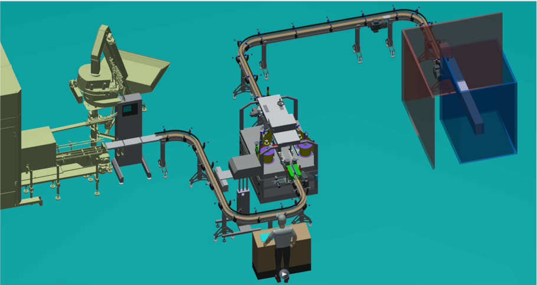

# 🤖Réalisation de la partie convoyage d'une ligne d'embouteillage de bidon d'huile

Le but de ce projet est de réaliser la gestion du convoyage entre les différentes machines de la ligne, et gérer les échanges d'informations entre l'automate et les machines.

Ce projet a été géré avec le matériel suivant :

* Un automate S7-1200 de chez Siemens
* Une Interface Homme-Machine (IHM) unified de chez Siemens
* 3 variateurs de vitesse ATV-320 de chez Schneider pilotés en Profinet par l'automate

Voici un aperçu 3D de la ligne :

La suite est en développement, soyez patient !

[Retour à l'accueil](index.md)