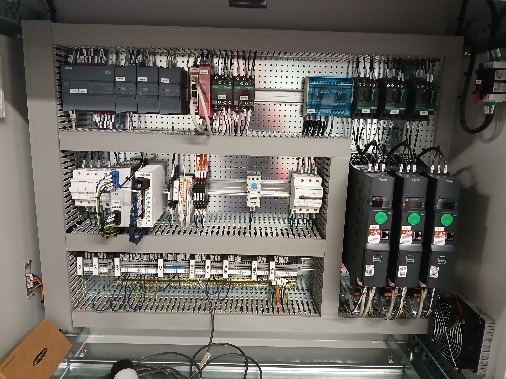
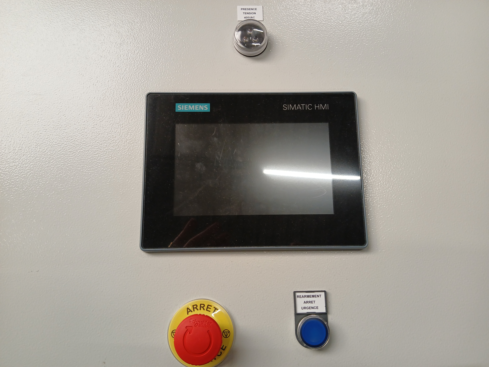

# 🤖Réalisation de la partie convoyage d'une ligne d'embouteillage de bidon d'huile

Le but de ce projet est de réaliser la gestion du convoyage entre les différentes machines de la ligne, et gérer les échanges d'informations entre l'automate et les machines.

Il a été développé en 6 jours au total comprenant :

 * 1 jour de réalisation de l'analyse fonctionnelle
 * 3 jours de développement du programme et de l'IHM
 * 1 jour d'essais
 * 1 jour de mise en service chez le client

Ce projet a été géré avec le matériel suivant :

* Un automate S7-1200 de chez Siemens
* Une *Interface Homme-Machine* (IHM) unified de chez Siemens
* 3 variateurs de vitesse ATV-320 de chez Schneider pilotés en Profinet par l'automate

### ⚙️ Le processus de production

Pour bien comprendre le rôle des convoyeurs, voici le parcours précis d'un bidon d'huile tout au long de cette ligne :

1. **💧 Le remplissage :** Le cycle débute par la remplisseuse, qui dose et injecte l'huile dans les bidons vides en entrée de ligne.
2. **🔥 Le thermoscellage :** Les bidons passent ensuite dans une thermocelleuse. Cette machine chauffe et dépose une opercule pour garantir la parfaite étanchéité du produit.
3. **🏷️ L'étiquetage :** Arrivée dans l'étiqueteuse, où l'habillage visuel du bidon et les codes-barres de traçabilité sont appliqués.
4. **📦 L'encaissage :** Enfin, la ligne s'achève par une encaisseuse qui regroupe et range proprement les bidons dans des cartons, prêts pour la zone de stockage.

Voici un aperçu 3D de la ligne :

Sur ce projet nous gérons tous les cas possibles comme un moteur HS, des bourrages suites à un arrêt d'une machine etc... Evidemment, afin de pouvoir dépanner au plus vite, chaque problème est remonté grâce à une alarme IHM qui permet un diagnostique rapide.

La ligne est entièrement configurable grâce à l'*Interface Homme-Machine*, comme :

* La mise en service 
* Le changement de mode :
    * Manuel
    * Automatique
* La vitesse des convoyeurs
* L'acquittement et le diagnosique de la machine
* La visualisation en temps réel du process

  

    
    
L'armoire électrique

  

  

    
    
Interface Homme-Machine (IHM)

  

[Retour à l'accueil](index.md)